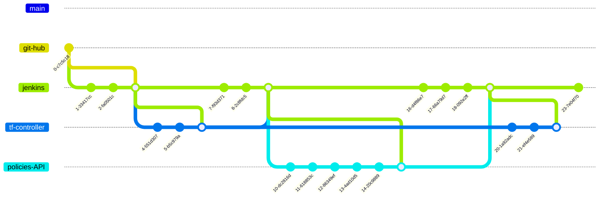

# cc-iac_account_id_stacks

## Resumo

Este repositório contém a infraestrutura como código (IaC) para a configuração e gerenciamento de recursos na nuvem. Utiliza Terraform e Terragrunt para orquestrar e modularizar a infraestrutura de forma eficiente e escalável.

## Objetivo
O principal objetivo deste projeto é fornecer uma estrutura clara e reutilizável para a criação e gerenciamento de recursos na nuvem, garantindo a consistência e a facilidade de manutenção em diferentes ambientes (desenvolvimento, teste, produção).

## Arquitetura

A arquitetura do projeto é baseada em módulos Terraform, que são usados para definir e configurar recursos de nuvem específicos como EC2, VPC e CloudWatch. Cada módulo é projetado para ser reutilizável e configurável para diferentes ambientes.

```
iac__account_id_namespace_stacks_env
│
├── LICENSE                    # License file for the project
├── README.md                  # README file with project description and instructions
├── how_to_create_module.md    # Guide on how to create a module in this setup
├── terragrunt.hcl             # Terragrunt configuration file
│
└── account                    # Main directory for account configurations
    ├── backend.tf             # Terraform backend configuration
    ├── main.tf                # Main Terraform configuration file
    ├── outputs.tf             # Terraform outputs file
    ├── variables.tf           # Terraform variables file
    │
    └── namespace              # Namespace directory for organizing (Core , Governance, Tools departaments)resources
        ├── modules            # Modules directory containing reusable components
        │   ├── cloudwatch     # CloudWatch module
        │   │   ├── main.tf    # Main file for CloudWatch module
        │   │   ├── outputs.tf # Outputs for CloudWatch module
        │   │   └── variables.tf# Variables for CloudWatch module
        │   │
        │   ├── ec2            # EC2 module
        │   │   ├── main.tf    # Main file for EC2 module
        │   │   ├── outputs.tf # Outputs for EC2 module
        │   │   └── variables.tf# Variables for EC2 module
        │   │
        │   └── vpc            # VPC module
        │       ├── main.tf    # Main file for VPC module
        │       ├── outputs.tf # Outputs for VPC module
        │       └── variables.tf# Variables for VPC module
        │
        └── stack              # Stack directory for specific environment 
            ├── env           # Environment-specific configurations
            │   ├── dev       # Development environment
            │   │   └── terragrunt.hcl # Terragrunt config for d
            │   ├── prod      # Production environment
            │   │   └── terragrunt.hcl # Terragrunt config for production 
            │   └── test      # Test environment
            │       └── terragrunt.hcl # Terragrunt config for test 
            │
            ├── main.tf       # Main file for stack configurations
            ├── outputs.tf    # Outputs for stack configurations
            └── variables.tf  # Variables for stack configurations
```

This structure shows a clear separation of concerns and modular design, typical in infrastructure as code (IaC) projects using Terraform and Terragrunt. The `modules` directory contains reusable definitions for various AWS services, while the `env` directory under `stack` allows for environment-specific configurations (development, production, test), each with its own Terragrunt configuration.


## Como configurar o backend.tf

Para configurar o `backend.tf`, siga estas etapas:
1. Defina o bucket S3 onde o estado do Terraform será armazenado.
2. Configure a região e os detalhes de acesso.
3. Especifique o bloqueio de estado usando DynamoDB para evitar conflitos de estado.

Exemplo de configuração:
```hcl
terraform {
  backend "s3" {
    bucket         = "<bucket-name>"
    key            = "<path-to-state-file>"
    region         = "<region>"
    dynamodb_table = "<dynamodb-lock-table>"
    encrypt        = true
  }
}
```

## Veja como um recurso é criado

### Padronização de nomenclatura
Para garantir a consistência e evitar conflitos, os recursos são nomeados seguindo um padrão definido. O padrão de nomenclatura é configurado da seguinte maneira:

```hcl
inputs = {
  resource_name = format("%s__%s__%s__%s__%s__%s", 
    inputs.account, 
    inputs.namespace, 
    inputs.stack, 
    inputs.env, 
    inputs.resource_name, 
    inputs.resource_type
  )
}
```

## Env variables

```hcl
$AWS_ACCESS_KEY_ID
$AWS_SECRET_ACCESS_KEY
$AWS_DEFAULT_REGION
$ACCOUNT
$NAMESPACE
$STACK
$ENV

```

## Como contruir uma infra para o ambiente de DEV

execute o comando: `terragrunt plan-all --terragrunt-non-interactive --terragrunt-working-dir ./account/namespace/stack/env`

```hcl
inputs = {
  account = "843210383"
  namespace = "core"
  stack = "tool_abc"
  env = "dev"
  resource_name = "my_ec2_instance"
  resource_type = "aws_instance"
}
```


Terá esse nome : account__namespace__stack__dev__resource_name__resource_type_

account: 843210383
namespace: core
stack: tool_abc
env: dev
resource_name: my_ec2_instance
resource_type: aws_instance

Nome:

843210383__core__tool_abc__dev__my_ec2_instance__aws_instance

## Como desctruir uma infra?

execute o comando: `terragrunt destroy-all --terragrunt-non-interactive --terragrunt-working-dir ./account/namespace/stack/env`


## Pipeline



## OUTPUT - 

Account: 843210383
Namespace: core
Stack: tool_abc
Env: dev


Vpcs

Id: vpc-0e031XXXXX
Name: 843210383__core__tool_abc__dev_vcp
Cidr Block: 10.0.0.0/25
Dhcp Options Id: dopt-XXXXX

Subnets

Id: subnet-XXXXX
Name: 843210383__core__tool_abc__dev_subnet_1
Cidr Block: 10.64.193.224/28
Vpc Id: vpc-0e031XXXXX
Availability Zone: us-east-1b
Available Ip Address Count: 11

## Security Groups

Id: sg-0abXXXX
Name: 843210383__core__tool_abc__dev_subnet_sg_main
Group Name: 843210383__core__tool_abc__dev_subnet_group_main
Vpc Id: vpc-0e031XXXXX
Description: 843210383__core__tool_abc__dev_subnet_group_main
created 2020-06-24T15:52:23.545-03:00